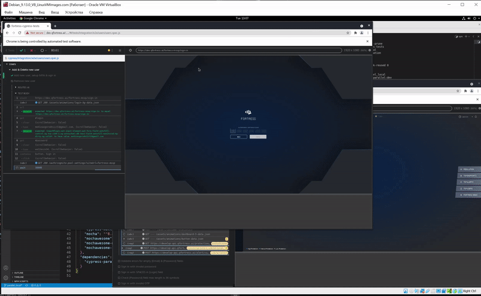
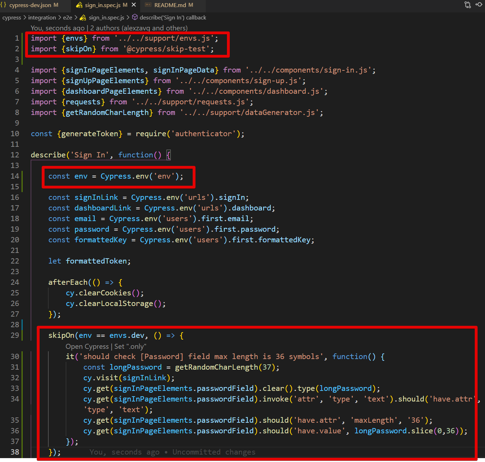
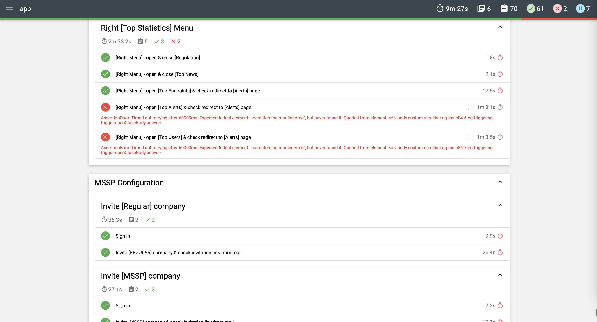

# Cypress tests for Fortress project

Table of contents
=================

<!--ts-->
   * [General info](#general-info)
   * [Installation](#installation)
   * [Open Cypress test runner for manual test selection](#open-cypress-test-runner-for-manual-test-selection)
   * [Run E2E tests](#run-e2e-tests)
   * [Run API tests](#run-api-tests)
   * [Run tests in parallel](#run-tests-in-parallel)
   * [Skip tests on specific env](#skip-tests-on-specific-env)
   * [Code error checking](#code-error-checking)
   * [Reports](#reports)
     * [Mochawesome](#mochawesome)
     * [Allure](#allure)
<!--te-->

---
## General info

- Jenkins job which runs the tests https://jenkins.qfortress.ai/job/autotests/job/cypress-dev/

- Slack channel for Jenkins alerts https://fortress-kok8877.slack.com/archives/C01Q1QNJTUZ

⚠️ If you run tests locally, the users will be the same as on DEV environment, because local env is pointing to DEV DB.

---
## Installation

1. **Clone this repo to your local machine**

2. **Go to root folder (fortress-cypress-tests)**

3. **Execute commands:**
    - :fast_forward: `npm install`
    - :fast_forward: `npm install -g "cypress@7.6.0"`
    - :fast_forward: `npm install --save-dev "cypress@7.6.0" cypress-multi-reporters mocha mochawesome mochawesome-merge mochawesome-report-generator cypress-mailosaur cypress-commands cypress-dark "@cypress/skip-test" cypress-localstorage-commands cypress-parallel eslint eslint-plugin-chai-friendly eslint-plugin-cypress "@shelex/cypress-allure-plugin" allure-commandline del`

---
## Open Cypress test runner for manual test selection

These commands open Cypress runner on a specific environment. After that you can select the test which you wish to execute. Keep in mind that once test is selected - making any changes to the code will re-run the test. This is embedded into Cypress architechture and can only be undone by closing the test runner manually.

**Open test runner locally:**
- :fast_forward: `npm run open:local`

**Open test runner on DEV:**
- :fast_forward: `npm run open:dev`

**Open test runner on STAGE:**
- :fast_forward: `npm run open:stage`

---
## Run E2E tests

**Run all e2e tests locally:**
- :fast_forward: `npm run cy:run:e2e:local`

**Run all e2e tests on DEV:**
- :fast_forward: `npm run cy:run:e2e:dev`

**Run all e2e tests on STAGE:**
- :fast_forward: `npm run cy:run:e2e:stage`

:information_source: **_HINT_**
- video recording is enabled for failed tests on local env, the videos can be found in directory `./cypress/videos`

---
## Run API tests

**Run all e2e tests locally:**
- :fast_forward: `npm run cy:run:api:local`

**Run all e2e tests on DEV:**
- :fast_forward: `npm run cy:run:api:dev`

**Run all e2e tests on STAGE:**
- :fast_forward: `npm run cy:run:api:stage`

---
## Run tests in parallel

**Run all e2e tests in parallel locally:**
- :fast_forward: `npm run cy:parallel:e2e:local`

**Run all e2e tests in parallel on DEV:**
- :fast_forward: `npm run cy:parallel:e2e:dev`

**Run all e2e tests in parallel on STAGE:**
- :fast_forward: `npm run cy:parallel:e2e:stage`

:information_source: **_HINT_**
- **_such command runs tests with 2 Cypress instances_**, in order to change the number of instances go to `package.json` and change value before the `-t` argument, which stands for `--threads`
- inspired by [cypress-parallel](https://github.com/tnicola/cypress-parallel)

Here's how it looks:


---
## Skip tests on specific env

Current solution is based on package https://github.com/cypress-io/cypress-skip-test

In order to compare envs, they're defined in 2 places:

1. cypress config (e.g. `cypress-dev.json`)
2. in file `cypress\support\envs.js`

In order to skip a test on the specific env, do the following in your `spec` file:

- import `envs` object by adding `import {envs} from '../../support/envs.js';`
- import the `skipOn` method by adding `import {skipOn} from '@cypress/skip-test';`
- define Cypress env as a constant `const env = Cypress.env('env');`
- encapsulate the `it` or `describe` for the test or set of tests which you want to skip, e.g:
    ```
    skipOn(env == envs.dev, () => {
        it('should skip this test on dev env', function() {
            // do something
        });    
    });
    ```
    
Here's how it looks like in a real test:


---
## Code error checking
Typical error fixing can be done via `eslint`.

Config file can be found in project root `.eslintrc.json`.

[Eslint rules list](https://eslint.org/docs/rules/)

**check project root folder**
- :fast_forward: `./node_modules/.bin/eslint ./`

**fix errors**
- :fast_forward: `./node_modules/.bin/eslint ./ --fix`

---
## Reports
### Mochawesome
* commands that contain `npm run pretest` & `npm run posttest` (e.g. `e2e:dev`) will run tests with `mochawesome` reporter
* in order to view results - open report file `cypress/reports/mochareports/report.html`

Example:


### Allure
Command sequence for correct report creation

1. move previous results to history
- :fast_forward: `npm run allure:history`

2. remove assets
- :fast_forward: `npm run allure:clear`

3. run required tests, for example:
- :fast_forward: `npm run cy:run:e2e:dev`

4. generate report
- :fast_forward: `npm run allure:report`

5. there are 2 ways to open generated report
- :fast_forward: `npm run allure:open`
  or
- open file `allure-report/index.html`

Example:
