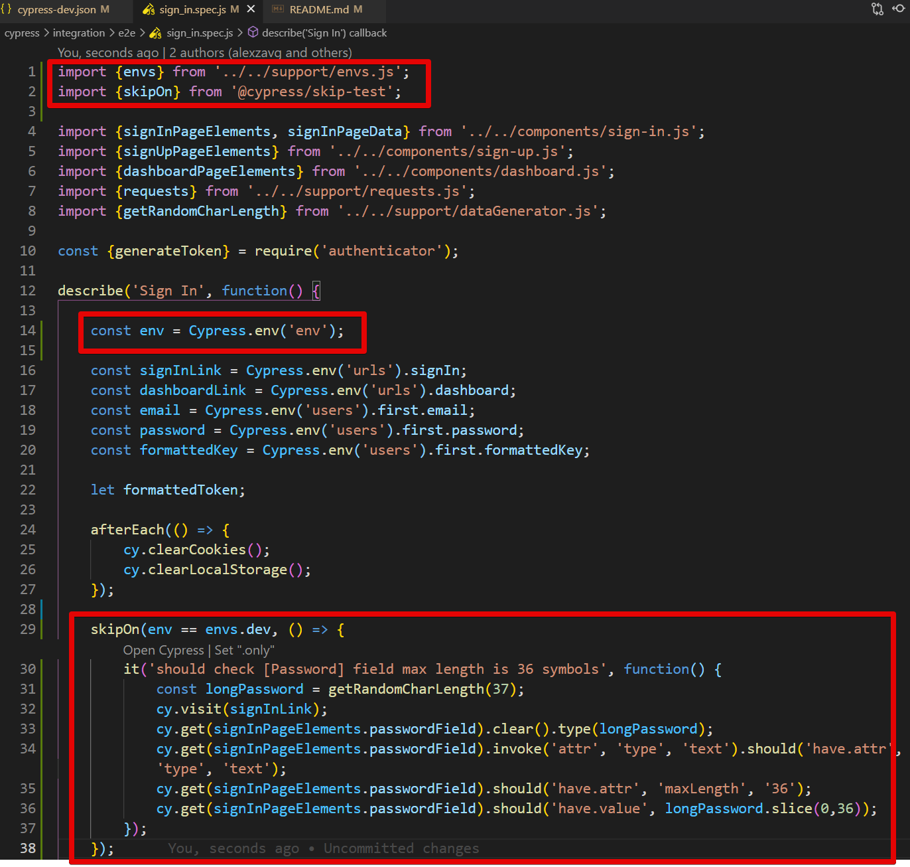

# Cypress e2e tests for Fortress project
## General info

- Jenkins job which runs the tests https://jenkins.qfortress.ai/job/autotests/job/cypress-dev/

- Slack channel for Jenkins alerts https://fortress-kok8877.slack.com/archives/C01Q1QNJTUZ

- (!) If you run tests locally, the users will be the same as on DEV environment, because local env is pointing to DEV DB.

---
## Installation

1. **Clone this repo to your local machine**

2. **Go to root folder (fortress-cypress-tests)**

3. **Execute commands:**
    - `npm install`
    - `npm install -g "cypress@7.5.0"`
    - `npm install "cypress@7.5.0" cypress-multi-reporters mocha mochawesome mochawesome-merge mochawesome-report-generator cypress-mailosaur cypress-commands cypress-dark "@bahmutov/cypress-extends" "@cypress/skip-test" cypress-localstorage-commands --save-dev`

---
## Open Cypress test runner for manual test selection

These commands open Cypress runner on a specific environment. After that you can select the test which you wish to execute. Keep in mind that once test is selected - making any changes to the code will re-run the test. This is embedded into Cypress architechture and can only be undone by closing the test runner manually.

**Open test runner locally:**
- `npm run open:local`

**Open test runner on DEV:**
- `npm run open:dev`

**Open test runner on STAGE:**
- `npm run open:stage`

---
## Running E2E tests

**Run all e2e tests locally:**
- `npm run cy:run:e2e:local`

**Run all e2e tests on DEV:**
- `npm run cy:run:e2e:dev`

**Run all e2e tests on STAGE:**
- `npm run cy:run:e2e:stage`

**_HINT_**: video recording is enabled for failed tests on local env, the videos can be found in directory `./cypress/videos`

---
## Running API tests

**Run all e2e tests locally:**
- `npm run cy:run:api:local`

**Run all e2e tests on DEV:**
- `npm run cy:run:api:dev`

**Run all e2e tests on STAGE:**
- `npm run cy:run:api:stage`

---
## Skipping tests on specific env

Current solution is based on package https://github.com/cypress-io/cypress-skip-test

In order to compare envs, they're defined in 2 places:

1. cypress config (e.g. `cypress-dev.json`)
2. in file `cypress\support\envs.js`

In order to skip a test on the specific env, do the following in your `spec` file:

- import `envs` object by adding `import {envs} from '../../support/envs.js';`
- import the `skipOn` method by adding `import {skipOn} from '@cypress/skip-test';`
- define Cypress env as a constant `const env = Cypress.env('env');`
- encapsulate the `it` or `describe` for the test or set of tests which you want to skip, e.g:
    ```
    skipOn(env == envs.dev, () => {
        it('should skip this test on dev env', function() {
            // do something
        });    
    });
    ```
    
Here's how it looks like in a real test:
